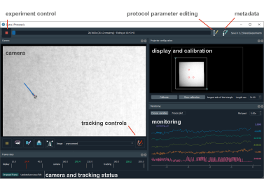

Stytra user interface
=====================

The toolbar on top controls running of the protocols: starting and stopping,
progress display, opening a dialog for protocol settings, changing the metadata and
save destination.

The rest of the interface is reconfigured depending on the experiment type.
Each panel can be moved separately and closed.
To reopen a closed panel, you can right-click on the title bar of any panel and
a list of all available panels will appear.

The camera panel buttons are for:

- pausing and starting the camera feed
- activating the replay (for a region selected when the camera is paused). Refer to :ref:`replaying` section for details.
- adjusting camera settings (framerate, exposure and gain)
- capturing the current image of the camera (without the tracking results superimposed
- turning on and off auto-scaling of the image brightness range.

- selection box to display the image at a particular stage in the tracking pipeline
- button for editing the tracking settings

The framerate display widget shows current framerates of the stimulus display,
camera and tracking. If minimum framerates for display or tracking are configuresd,
the indicators turn red if the framerate drops. These are configured in the stytra_config dict
for a protocol or setup_config.json file in the following sections::

    stytra_config = dict(
            display=dict(min_framerate=50),
            camera=dict(min_framerate=100),
        )

The monitoring widget shows changing variables relating to the stimulus, tracking or estimation of the animal state for closed-loop stimulation use

The status bar shows diagnostic messages from the camera or tracking.