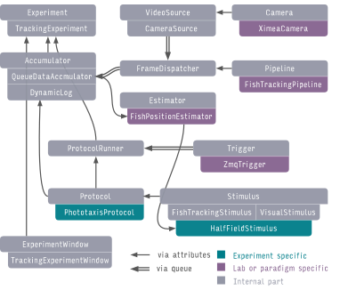

..  _sytra-struct:

The structure of Stytra
=======================

.. image:: ../../figures/data_flow.svg
   :scale: 80%
   :alt: dataflow diagram
   :align: center

We developed Stytra using the Python programming language. We endeavored to follow best practices in software engineering: separation of user interface and data processing code, modularity and consistent programming interfaces.

In Stytra, new experiments can be designed using very simple Python syntax, allowing even beginners in programming to develop their own stimulation paradigms. Once defined, the experiment is controlled through a graphical user interface which can be used with no knowledge of Python.

At the core of the Stytra package lies the :class:`~stytra.experiments.Experiment` object, which links all components that may be used in an experiment: stimulus presentation, camera, animal tracking, metadata and logging. This organization enables composing different experimental paradigms with full code reuse. Improvement of different modules (e.g. the user interface, plotting or tracking) is therefore reflected in all experimental setups, and support for a new piece of hardware or tracking function can be added with minimal effort and interference
with other parts of the project. Online image processing is organized along
a sequence of steps: first, images are acquired from the camera, then the image is filtered and tracked, and the tracking results are saved. Acquisition, tracking and data saving occur in separate processes (depicted in blue, purple, and green in the diagram below).

.. image:: ../../figures/data_flow.svg
   :width: 540px
   :alt: dataflow diagram
   :align: center

|

This approach improves the reliability and the performance of online behavioral tracking, and exploits the advantages of multi-core processors. After processing, streaming numerical data (such as tracking results and dynamic parameters of stimuli) is passed into data accumulators in the main thread, and a user-selected subset can be plotted in real time and saved in one of the several supported formats. Moreover, for every experimental session all changeable properties impacting the execution of the experiment are recorded and saved. Finally, as the software package is version-controlled, the version (commit hash) of the software in use is saved as well, ensuring the complete reproducibility of every experiment.

.. _dataflow-block:

Basic classes
_____________
The :class:`~stytra.experiments.Experiment` object binds all the different components required to run an experiment. The most basic :class:`~stytra.experiments.Experiment` object performs the presentation of a succession of stimuli, saving the experiment metadata and the stimulation log. For experiments including video tracking, the :class:`~stytra.experiments.tracking_experiments.TrackingExperiment` object augments the basic :class:`~stytra.experiments.Experiment` with features such as camera frame acquisitions and online image analysis. The image analysis pipeline can be one of the zebrafish specific pipelines supplied with Stytra, or a custom tracking pipeline. The :class:`~stytra.experiments.Experiment` is linked to the  user interface for controlling the running of stimulation protocols, inserting metadata, controlling parameters, and calibrating the stimulus display. For details of the user interface, please see the :ref:`user interface <gui-desc>` section of the documentation.

In general, the users do not need to define new types of :class:`~stytra.experiments.Experiment` objects for every new experimental paradigm. Instead, paradigms are implemented by defining a :class:`~stytra.stimulation.Protocol`  object which contains the stimulus sequence (as described below) and a configuration dictionary with information about the camera, tracking pipeline, and triggering. The appropriate :class:`~stytra.experiments.Experiment`  object can be automatically instantiated from the configuration dictionary using the Stytra constructor. Alternatively, an :class:`~stytra.experiments.Experiment`  can be instantiated and run from the experiment script, as described in the documentation examples. Ideally, the provided :class:`~stytra.experiments.Experiment`  objects should cover most of the requirements of zebrafish behavioral experiments, and  redefining the :class:`~stytra.experiments.Experiment`  is required only if one needs to modify the  graphical user interface (GUI), add more nodes in the data pipeline (screens or cameras) or implement more specific customizations. A more detailed depiction of the connections and versions of different objects is depicted in above.  For examples of how to create a :class:`~stytra.stimulation.Protocol`  and run experiments in Stytra, see :ref:`protocol-definition`.
