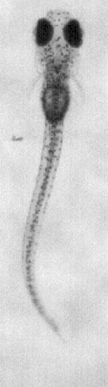
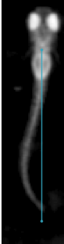
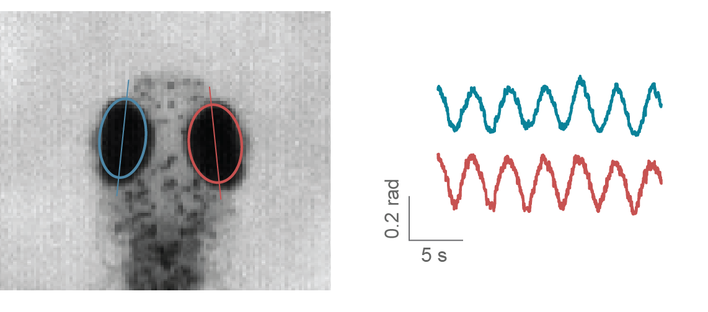
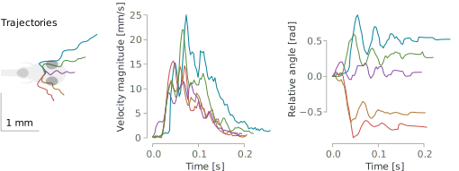

.. role:: red
.. role:: yellow
.. role:: blue

.. raw:: html

     

.. _tracking-desc:

Image acquisition and tracking
==============================

Image acquisition
-----------------

A key feature of Stytra is the extraction of relevant behavioral features in real time from video inputs. The :class:`Camera <stytra.hardware.video.cameras.interface.Camera>` object provides an interface for grabbing frames and setting parameters for a range of different camera types. Currently supported models include those by XIMEA, AVT, PointGray/FLIR, and Mikrotron, as well as webcams supported by OpenCV :cite:`opencv_library`. Support for other cameras can be added as long as a Python or C API exists. In addition, previously-recorded videos can also be processed, allowing for offline tracking. Frames are acquired from the original source in a process separated from the user interface and stimulus display. This ensures that the acquisition and tracking frame rate are independent of the stimulus display, which, depending on the complexity of the stimulus and output resolution, can be between 30 and 60 Hz.

Tracking pipelines
------------------

The :class:`tracking process <stytra.tracking.tracking_process.TrackingProcess>` receives acquired frames and handles animal tracking (as described :ref:`here <dataflow-block>`). Image processing and tracking are defined in subclasses of :class:`Pipeline <stytra.tracking.pipelines.Pipeline>` objects and contain a tree of processing nodes, starting from input images and ending with tracking nodes that take images as input and give tracking results as output. This structure allows for multiple tracking functions to be applied on the same input image(s). Currently implemented image processing nodes include image filtering (down-sampling, inversion and low-pass filtering) and background subtraction.
The outputs of the tracking nodes are assembled together and streamed to the main process, where the data is saved and visualized. The :class:`Pipeline <stytra.tracking.pipelines.Pipeline>` object also allows specifying a custom camera overlay to display the results of the tracking and an additional plotting widget for an alternative visualization of data.

The developer documentation section on :ref:`tracking pipelines <dev-pipelines>` describes the implementation in detail.

Tracking the behavior of head-restrained fish
---------------------------------------------

Tail tracking
.............

Zebrafish larvae swim in discrete units called bouts, and different types of swim bouts, from startle responses to forward swimming are caused by different tail motion patterns :cite:`Budick2565`. The tail of the larvae can be easily skeletonized and described as a curve discretized into 7-10 segments :cite:`portugues2014whole` . The tail tracking functions work by finding the angle of a tail segment given the position and the orientation of the previous one. The starting position of the tail, as well as a rough tail orientation and length need to be specified beforehand using start and end points, movable over the camera image displayed in the user interface (as can be seen below).

To find the tail segments, two different functions are implemented. The first one looks at pixels along an arc to find their maximum (or minimum, if the image is inverted) where the current segment would end (as already described in e.g. :cite:`portugues2014whole`). The second method, introduced here, is based on centers of mass of sampling windows (see figure below), and provides a more reliable and smoother estimate over a wider range of resolutions and illumination methods. The image contrast and tail segment numbers have to be adjusted for each setup, which can be easily accomplished through the live view of the filtering and tracking results. In the documentation we provide :ref:`guidelines <guidelines>` on choosing these parameters. To compare results across different setups which might have different camera resolutions, the resulting tail shape can be interpolated  to a fixed number of segments regardless of the number of traced points.

.. raw:: html

    <video height="320px" loop src="../_static/tracking_anim.mp4"
        style="vertical-align:middle;margin-bottom:24px" autoplay controls> </video>

The image is first pre-processed by inverting, down-scaling, blurring and clipping, resulting in the image on the right, where the fish is the only object brighter than the background. Then, tail tracing starts from a user-defined point, and in the direction determined by another user-defined point at the end of the tail at rest (:blue:`blue line`). For each segment, a square (outlined in white) in the :yellow:`direction of the previous segment` is sampled, and the direction for the next segment is chosen as the :red:`vector` connecting the previous segment end and the center of mass of the sampled square.

Eye tracking
............

Zebrafish larvae move their eyes to stabilize their gaze in response to whole field motion, perform re-positioning saccades, and converge their eyes to follow a potential prey in hunting maneuvers :cite:`beck2004quantifying`. Naso-temporal eye movements can be described by the eye orientation with respect to the fish axis. Given the ellipsoidal shape of the eyes when seen from above, to find their orientation it is sufficient to fit an ellipse to the eye pixels and determine the angle of the major axis :cite:`beck2004quantifying`. In Stytra, a movable and scalable rectangular region can be used to select the area of the camera view containing the eyes. As eyes are usually much darker than the background, with proper illumination conditions it is  sufficient to binarize the image with an adjustable threshold which selects the pixels belonging to the eyes. Then, functions from the OpenCV library are used to find the two largest connected components of the binarized region and fits an ellipse to them. The absolute angle of the major axis of the ellipse is recorded as the eye angle. A live preview of the binarized image and the extracted ellipses helps the user to adjust the parameters.

The image below illustrates an example of ellipses fitted to the eyes and angle traces as the eyes were moving in response to a rotating windmill.

Freely-swimming fish tracking
-----------------------------

To support different kinds of paradigms where fish are not head-restrained, we provide functions for freely-swimming fish tracking. The range of behavioral paradigms include investigating movement evoked by different kinds of stimuli, characterizing motion kinematics and assessing consequences of pharmacological or genetic interventions. To track the fish in an open arena, the first required step is background subtraction. The background is modelled with a mean image taken from multiple frames averaged in time, and slowly updated with an adjustable time constant. The subsequently processed image is the negative difference between the current frame and the threshold (pixels that are darker than the background are active). This image is first thresholded and regions within the right area range are found. Both eyes and the swim bladder are found as darker parts inside of these regions, and the center of mass of the three objects (two eyes and swim bladder) is taken as the center of the fish head. The direction of the tail is found by searching for the point with the largest difference from the background on a circle of half-tail radius. This direction is subsequently refined in the course of tail tracking, as described in the tail tracking section. The kinematic parameters are smoothed by Kalman filtering. An example resulting from tracking multiple fish simultaneously is shown here:

.. raw:: html
   :file: ../../figures/bout_examples.html

The following panels show a five bouts in different directions with corresponding velocities and heading angles in time.

Fish identities are maintained constant while they are in the field of view and not overlapping, by keeping track of the previous positions and orientations. The number of fish does not significantly impact performance, however the resolution of the camera does, so we recommend a well-configured modern computer (7th generation and above Intel Core i7 processors or AMD Ryzen) for tracking multiple fish in a 90 mm dish. In our experiments not more than 3 fish are usually present, and a tracking framerate of 300 Hz can be reached reliably. We have also tracked individual fish in a 24-well plate, which presented no performance issues at 100 Hz with a mid-range CPU. Simpler tracking scenarios for screening, where the exact position, orientation and tail curvature of individuals are not of interest, can work with even higher numbers of animals.

Custom tracking functions
-------------------------
Stytra is designed in an extensible fashion and video tracking algorithms for other animals can be easily added. To demonstrate this, we provide a small example of DeepLabCut-based tracking, which can be integrated with very few lines of code and immediately used with closed-loop stimuli. DeepLabCut is a convolutional neural network-based pose estimation toolbox :cite:`Mathisetal2018` built on top of the DeeperCut architecture :cite:`insafutdinov2016eccv`. We incorporated an open-field recording example with the video and parameters provided in the original repository. The code for this example is in a separate `GitHub repository <https://github.com/portugueslab/Stytra-with-DeepLabCut>`_. The tracking performance of DeepLabCut mainly depends on video resolution and CPU and GPU performance. We managed to obtain a tracking speed of 20 Hz (resulting in a tracking latency of 50 ms) for a 640x480 px video on a computer equipped with a nVidia GeForce GTX Titan X GPU and Intel Xeon E5-2687W v3 CPU. For a detailed investigation of DeepLabCut performance see :cite:`Mathis457242`.

.. bibliography:: biblio.bib
