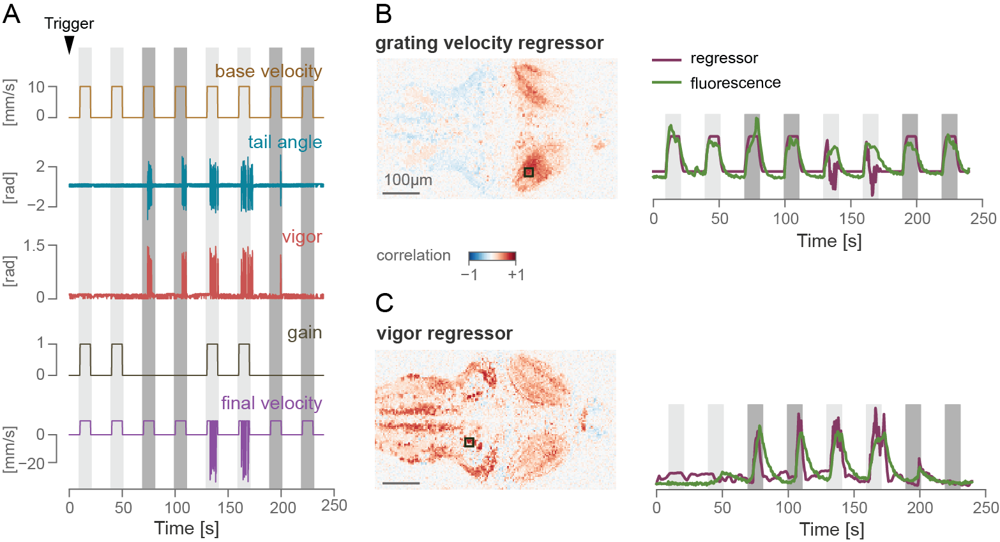

Synchronize stimulation with data acquisition
=============================================

Here, we demonstrate the communication with a custom-built two-photon microscope. We performed two-photon calcium imaging in a seven days post fertilization,  head-restrained fish larva pan-neuronally expressing the calcium indicator GCaMP6f (Tg(*elavl3*:GCaMP6f), :cite:`wolf2017sensorimotor`). For a complete description of the calcium imaging protocol see :cite:`kist2017whole`. These and following experiments were performed in accordance with approved protocols set by the Max Planck Society and the Regierung von Oberbayern.

We designed a simple protocol in Stytra consisting of either open- or closed-loop forward-moving gratings, similar to the optomotor assay described in the closed-loop section, with the gain set to either 0 or 1. At the beginning of the experiment, the microscope sends a ZeroMQ message to Stytra, as described in the previous section. This triggers the beginning of the visual stimulation protocol, as well as the online tracking of the fish tail, with a 10-20 ms delay. To match behavioral quantities and stimulus features with their evoked neuronal correlates, we used the data saved by Stytra to build regressors for grating speed and tail motion (for a description of regressor-based analysis of calcium signals, see :cite:`portugues2014whole`). Then, we computed pixel-wise correlation coefficients of calcium activity and the two regressors. The figure below reports the results obtained by imaging a large area of the fish brain, covering all regions from the rhombencephalon to the optic tectum. As expected, calcium signals in the region of the optic tectum are highly correlated with motion in the visual field, while events in more caudal regions of the reticular formation are highly correlated with swimming bouts. The Stytra script used for this experiment is available in the examples`.

