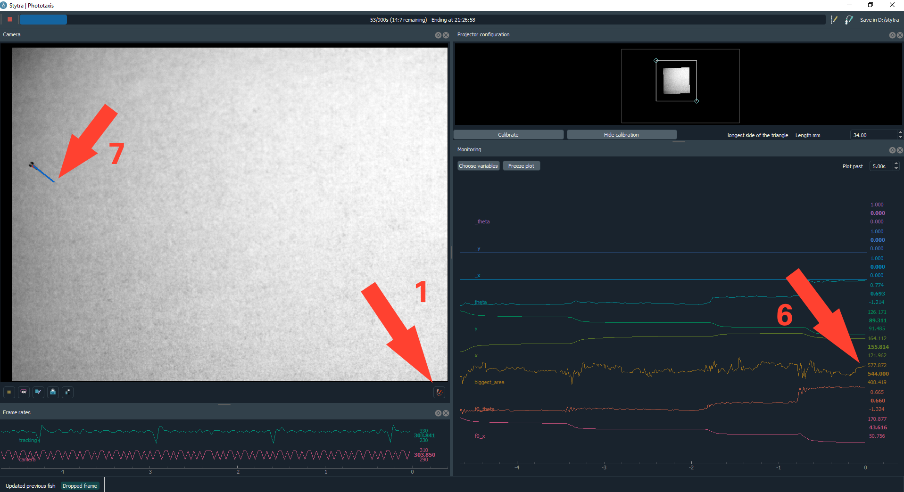

Tracking configuration
======================

.. _fishtracking:

Freely-swimming fish
--------------------

1) Open the tracking settings window

2) Input the number of fish in the dish

3) Determine the parameters for background subtraction
   bglearning_rate and bglearn_every
   Under the camera view, you can select the currently displayed image (raw for the )

4) Once you see the fish nicely, adjust the thresholded image,
   so that the full fish, but nothing more, is white bgdif_threshold

5) Adjust the eye threshold so that the eyes and swim bladder are highlighted (by changing the display_processed parameter)
   threshold_eyes

6) Adjust the target area:
   look at the biggest_area plot, if the background is correctly subtracted and a fish is in the field of view,
   the value should equal the current area of the fish. Choose a range that is comfortably around the current fish are

7) Adjust the tail length: the red line tracing the tail should not go over the actual tail.

8) If the fish jumps around too much, adjust the prediction uncertainty.

.. _tailtracking:

Embedded fish
-------------

1) Ensure that the exposure time is not longer than 1.5 milliseconds, otherwise
   the tracking will not be correct for fast tail movements

2) Open the tracking settings window

3) Invert the image if the tail is dark with respect to the background

4) Set the camera display to filtered and adjust clipping until the fish is the only
   bright thing with respect to the background, which has to be completely black.

5) Make the image as small as possible (with image_scale) as long as the tail is mostly more than 3px wide
   and filter it a bit (usually using filter_size=3)

6) Adjust the number of tail segments, around 30 is a good number. Usually, not more than 10 n_output_segments are required

7) Tap the dish or the stage so that fish flicks its tail, and ensure the that it is tracked correctly. There should be no breaks in the tail_sum plot, if there are, it is likely the tail length line is too long. You can use the replay function to ensure the whole movement is tracked smoothly

8) To ensure the tracking is correct, you can enable the plotting of the last bout in the windows

.. _replaying:

Replaying the camera feed to refine tracking
--------------------------------------------

The replay functionality allows a frame-by-frame view of the camera feed during
a period of interest (e.g. a bout or a struggle).
After an interesting event happens and you can see it in the plot, pause the camera with the
pause button. Use the two gray bars in the plots, select the time-period of interest.
Then, enable the replay with the button underneath the camera, and unpause the camera feed.
Now, the selected slice of time is replayed, and the framerate of the replay can be adjusted in the
camera parameters. To go back to the live feed, toggle the replay button.
